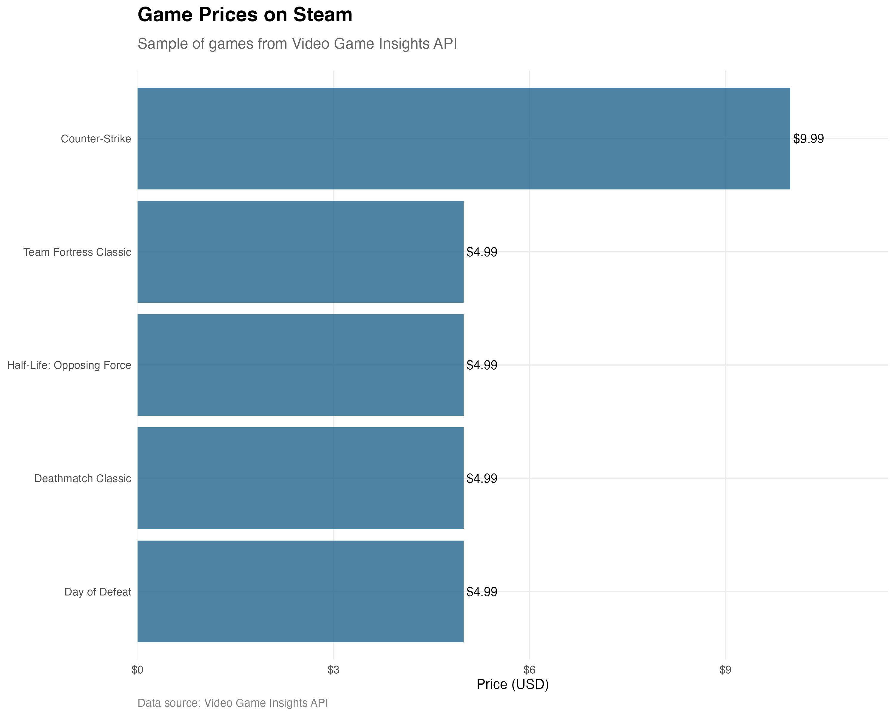
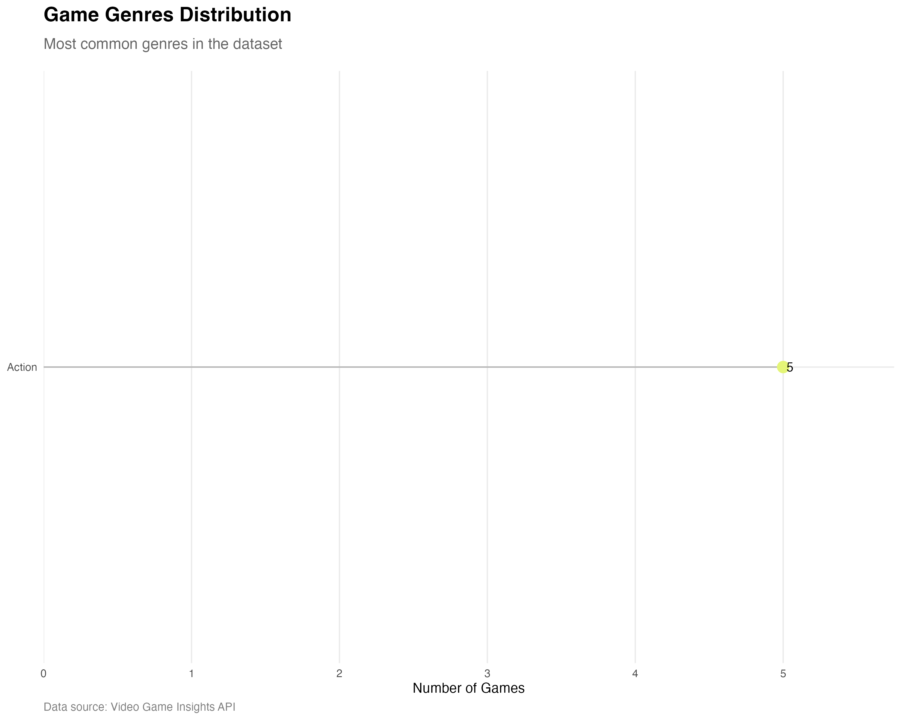
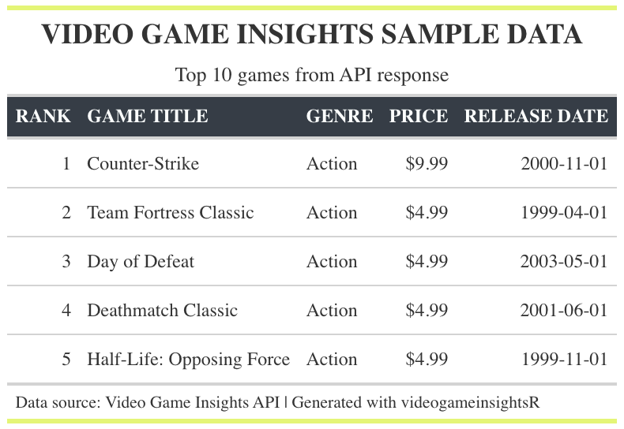

# videogameinsightsR

R package for interfacing with the Video Game Insights API to fetch comprehensive gaming analytics data across multiple platforms.

## Installation

```r
# Install from GitHub (once available)
# devtools::install_github("yourusername/videogameinsightsR")
```

## Authentication

Store your Video Game Insights API token as an environment variable:

```r
# Edit your R environment file
usethis::edit_r_environ()

# Add this line (replace with your actual token):
# VGI_AUTH_TOKEN="YOUR_SECRET_TOKEN_HERE"

# Restart R session for changes to take effect
```

## Overview

The videogameinsightsR package provides a comprehensive R interface to the Video Game Insights API, enabling:

- Game performance metrics across Steam, PlayStation, Xbox, and Nintendo platforms
- Player statistics and concurrent user data
- Market trends and competitive intelligence
- Revenue and unit sales estimates
- User reviews and sentiment analysis
- Platform-specific achievements and trophies data

## Core Functions

### Game Information

- `vgi_game_metadata()` - Get detailed metadata for a single game
- `vgi_game_metadata_batch()` - Get metadata for multiple games in one request
- `vgi_search_games()` - Search for games by title

### Rankings and Analytics

- `vgi_top_games()` - Get top games ranked by various metrics (revenue, units, CCU, DAU, followers)

## Usage Examples

```r
library(videogameinsightsR)

# Get metadata for a single game
valheim <- vgi_game_metadata(892970)

# Get metadata for multiple games
game_ids <- c(892970, 1245620, 105600)  # Valheim, Elden Ring, Terraria
games <- vgi_game_metadata_batch(game_ids)

# Search for games
rpg_games <- vgi_search_games("rpg", limit = 20)

# Get top games by revenue
top_revenue <- vgi_top_games("revenue", limit = 10)

# Get top Steam games by concurrent users
top_steam_ccu <- vgi_top_games(
  metric = "ccu",
  platform = "steam",
  limit = 25
)
```

## Example Visualizations

The package includes example scripts to generate various charts and tables using real API data.

### Generated Examples

Here are visualizations created with actual Video Game Insights API data:

#### Game Prices Comparison

*Bar chart showing game prices from the Steam catalog*

#### Genre Distribution

*Lollipop chart displaying the most common game genres*

#### Game Details Table

*GT table with GEC-style formatting showing game information*

### Generating Your Own Visualizations

To create these visualizations with your own API token:

```r
# Set your API token
Sys.setenv(VGI_AUTH_TOKEN = "your_token_here")

# Run the simplified visualization script
source("examples/generate_simple_charts.R")
```

The script will generate:
- Price comparison charts
- Genre distribution analysis
- Formatted data tables
- Publisher analytics (when available)

All outputs are saved as PNG files in `examples/outputs/` with the `_api` suffix.

## Requirements

- Valid Video Game Insights API token (required)
- R packages: ggplot2, dplyr, gt, scales

## Status

Core functionality is implemented. Additional insights endpoints (CCU history, revenue data, reviews analysis) are planned for future releases.
